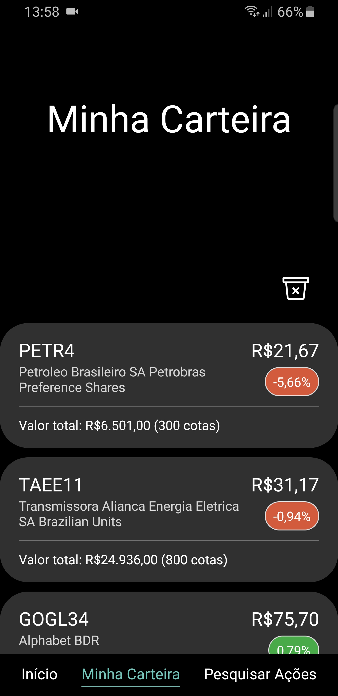
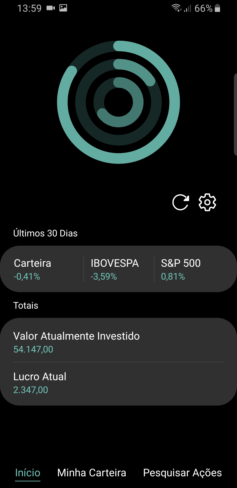
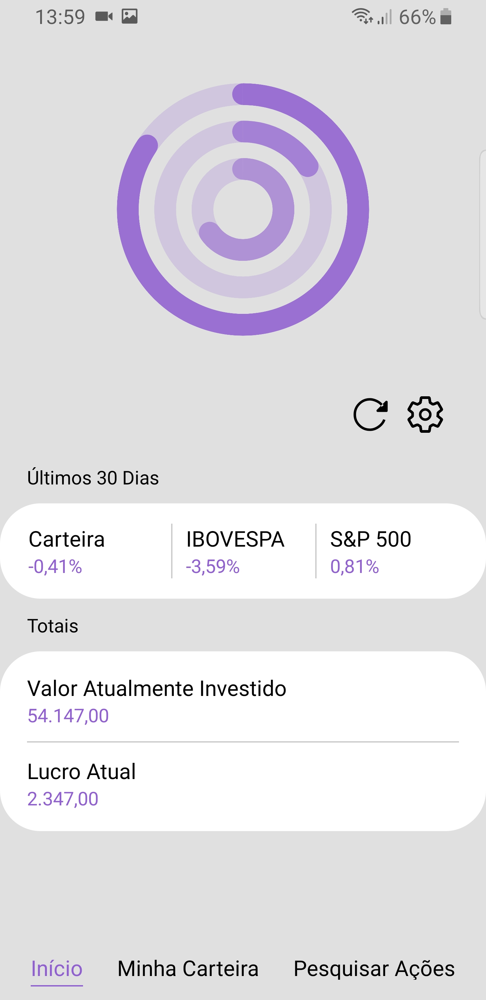
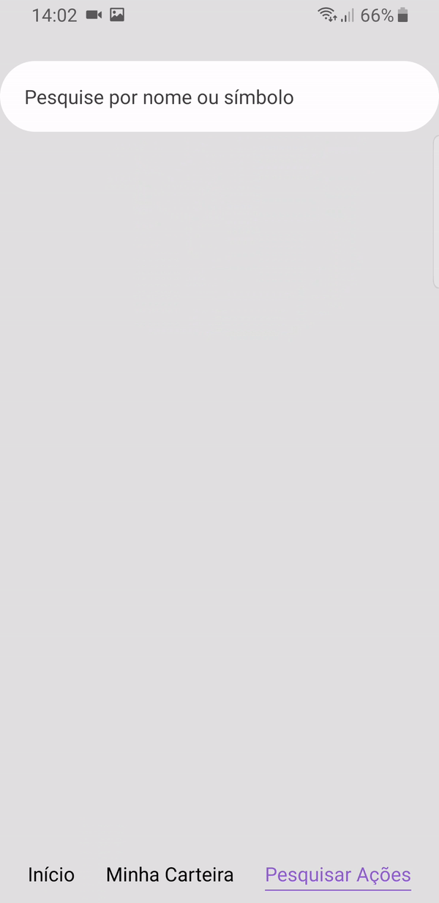
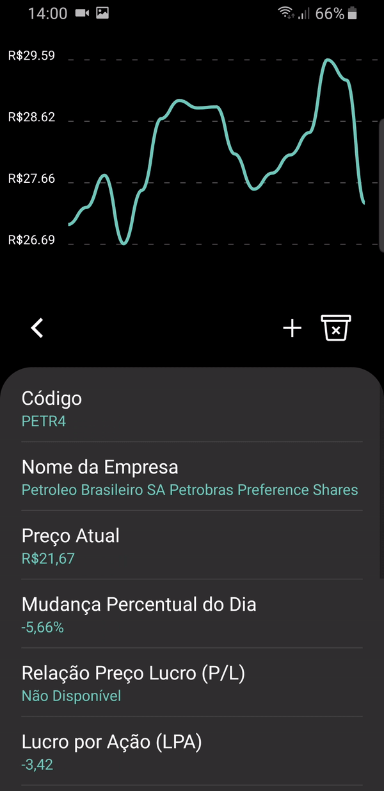
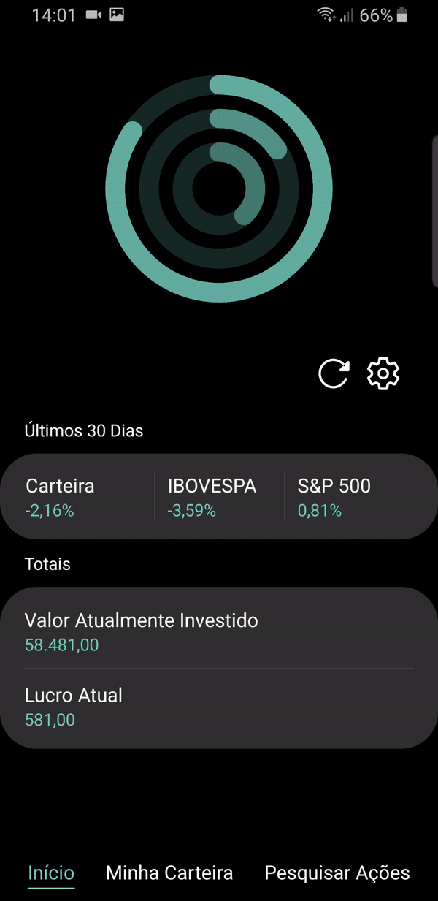
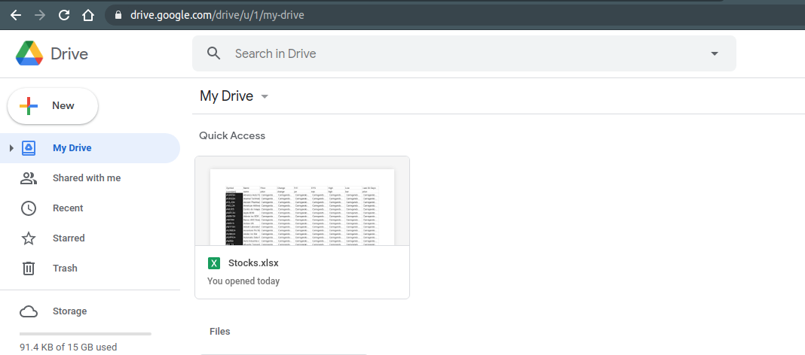
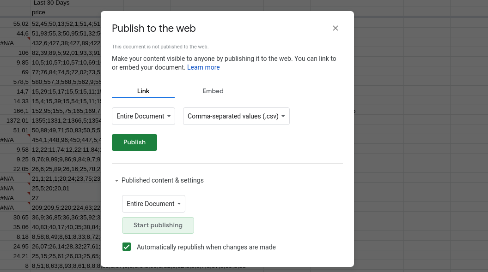
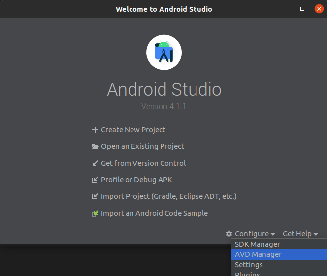

# Stocker

Stocker lets you keep track of your investments and the stocks in your interest.

> Design based on [Samsung's One UI](http://design.samsung.com/global/contents/one-ui/download/oneui_design_guide_eng.pdf)

> Developed using [React Native](https://reactnative.dev/) and [Expo](https://expo.io/)

> Market data acquired from the [Google Finance API](https://support.google.com/docs/answer/3093281?hl=en)

# Features

Stocker comes packed with handful features for everyday use:

## Track your stocks' performances

<p float="left">
    
    
</p>

## Compare your wallet's earnings to the most relevant Indexes

<p float="left">
    
    
</p>

## Search through all available stocks

<p float="left">
    

</p>

## Add stocks to your wallet, keeping track of all of your trades

<p float="left">
    
</p>

## Choose the interface theme that best suits you

<p float="left">
    
</p>

# Usage

## Google Finance API Setup

To be able to get data from Google Finance API, it must be exported from a Google Sheets spreadsheet.

> As stated on their online forum, direct calls (bypassing Google Sheets) will no longer be supported in the near future.

To create and publish the required file, follow those instructions:

1. Download the `docs/Stocks.xlsx` file from this repository.
2. Upload it to your Google Drive.
   

3. Open the uploaded file and select **_File > Publish to the web_**.
4. On the pop-up menu, change from **_Web Page_** to **_Comma-separated values (.csv)_**.
   
5. Hit **_Publish_** and copy the link provided.
6. Create a `./env` file and add the link as shown below.

```js
GOOGLE_FINANCE_URL = "<Paste_link_here>";
```

# Development Environment

## Environment Setup

The following requirements must be available:

- Mobile device emulator (Android/iOS) or an Android device connected via USB.
- [expo-cli](https://www.npmjs.com/package/expo-cli) _v4.0.17_
- [Node.js](https://github.com/nvm-sh/nvm) _v14.13.1_

### Android Studio (for device emulation)

First, install Android Studio.

```shell
sudo snap install android-studio --classic
```

Then, open the device emulator, by opening Android Studio, selecting `Configure > AVD Manager` and running the default Pixel virtual device.



### NodeJS

It's recommended to use the [Node Version Manager (nvm)](https://github.com/nvm-sh/nvm) to install Node. The Node version used is `v14.13.1`.

### Expo CLI

To install the [expo CLI](https://docs.expo.io/), use:

```shell
npm install --global expo-cli
```

## Project Setup

1. Clone the repository.
2. Open the device emulator (or connect an Android device).
3. Open the project's root directory in your terminal.
4. Install all dependencies with `npm install`.
5. Run the project with `expo start`. A [local server](localhost:19002) will open.
6. Using a web browser, access the server and select **_run on Android device/emulator_** or **_run on iOS simulator_**, on the sidebar.

The app will be started in the emulated (or plugged) device.

## VSCode Debugger

Before setting up the debugger, make sure to have the development environment up and running.

> Also, turn off the Remote Debbuging option on the Expo Development Tool.

1. Install the `React Native Tools` VSCode extension.
2. Open the VSCode Debug menu and select `create a launch.json file`.
3. On the pop-up menu, select `React Native` and `Attach to packager`. A `launch.json` file will be generated.
4. On `launch.json`'s `Attach to packager` entry, add `"port": 19000` (Expo debugging port).
5. On the top of the Debug menu, select `Attach to packager` on the drop-down input, and hit play.
6. On the device emulator, open Expo Development tools (Ctrl + M) and start remote debugging.
